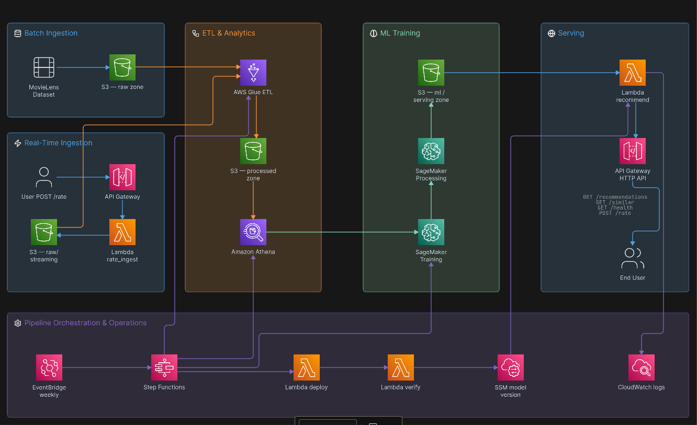

# Movie Recommendation System

An AWS-based movie recommender using a rating-aware hybrid two-tower model trained on MovieLens 1M data, scaled to serve recommendations in real time via FAISS + Lambda.

## Architecture



## How it works

1. **Data pipeline** — MovieLens ratings are uploaded to S3, cleaned and partitioned by a Glue ETL job, and stored as Parquet.

2. **Training** — A two-tower model is trained on SageMaker with an in-batch sampled softmax that is **rating-aware**: each positive pair is weighted by its rating magnitude (5★ counts more than 3★) and low ratings (≤2★) contribute an explicit negative term. User representations also blend a learned id embedding with **rating history** — a signed, rating-weighted mean of the item vectors for the movies the user already rated (train-split only, no leakage) — and an auxiliary rating head predicts 1–5. A weekly Step Functions pipeline handles retraining automatically.

3. **Publishing** — A Processing Job converts the PyTorch checkpoint into a self-contained numpy + FAISS bundle (weights, item embeddings, user features, **per-user history vectors**, FAISS index, dislike sets), verified by a numpy-vs-torch parity gate, an HNSW recall gate, and a validation **fusion search** that picks the hybrid rerank weight `α`.

4. **Serving** — A Lambda (numpy + FAISS, no torch) computes the history-aware user vector, searches the ANN index, then **hybrid-reranks**: `score = α·simNorm + (1−α)·ratingNorm`, where α is validation-tuned. Movies the user rated ≤2★ are automatically filtered out, and everywhere else a predicted rating is returned.

5. **API** — API Gateway exposes the model as HTTP endpoints. New ratings posted to the API are fed back into the next training run.

## Setup

```bash
python3 -m venv .venv
source .venv/bin/activate
pip install -r requirements.txt
cp .env.example .env    # fill in your values
cd terraform && terraform init && terraform apply
```

### Seed the data

```bash
python scripts/upload_raw.py --bucket recsys-dev-bucket
aws glue start-job-run --job-name recsys-dev-etl
```

## Retrain pipeline

Triggered weekly by EventBridge, or manually:

```bash
EPOCHS=25 bash scripts/sage/start_retrain.sh
```

| Stage | Description |
|---|---|
| RunEtl | Glue cleans raw ratings, dedupes by (user, movie), writes Parquet |
| PrepareData | Athena exports training tables to flat CSVs |
| Train | SageMaker trains the rating-aware two-tower model with history |
| Publish | Converts checkpoint to a numpy + FAISS bundle; tunes hybrid `fusion_alpha` on validation |
| Deploy | Points the serving Lambda at the new model |
| Verify | Smoke-tests the live API |

## Ablation (15 epochs, same split/tuning; full-catalog best-checkpoint val metrics)

| Variant | NDCG@10 | Hit@10 | Precision@10 | val RMSE |
|---|---|---|---|---|
| V0 original model (`--no-rating-aware`) | 0.1243 | 0.5906 | 0.1132 | 0.8648 |
| V1 + rating-aware loss | **0.1291** | 0.5280 | **0.1158** | 0.8840 |
| V2 + history | 0.1262 | 0.5528 | 0.1127 | 0.8714 |
| V3 + hybrid fusion rerank (α=0.25) | 0.1275 | 0.5603 | — | — |

Honest read: rating-awareness raises NDCG@5/10 (+3.9%) and precision but lowers Hit@10/recall. Hit@K counts *every* held-out rating as equally relevant, so a model that now correctly deprioritizes 1–3★ items is "penalized" by it even though top-list ordering (NDCG) improves. History (V2) partially recovers recall while holding NDCG above baseline and adds the dislike filter. Fusion (V3) adds a small measured gain over V2. See `docs/interview-prep/` for the full discussion.

## API

Base: `https://r2qunvrdaa.execute-api.us-east-1.amazonaws.com/prod`

| Route | Method | Description |
|---|---|---|
| `/recommendations?user_id=1&k=10` | GET | Get ranked recommendations (history-aware, hybrid reranked) |
| `/similar?movie_id=1&k=5` | GET | Find similar movies |
| `/health` | GET | Service health check |
| `/rate` | POST | Submit a rating (`user_id`, `movie_id`, `rating`) |

